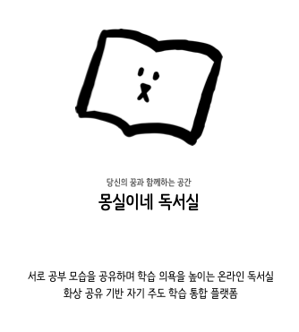

# 몽실이네 독서실(MongDok)

몽실이네 독서실에서 함께 공부해보세요(Study with MongDok)😊 👉[몽실이네 독서실](https://www.mongdok.com)👈

<br>

## Member & Role 👪

**몽실이 제자들(Mongsil's disciples)**

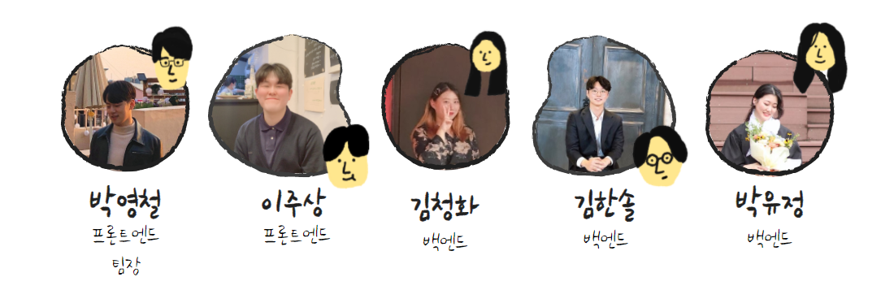

#### 박영철(팀장)

- FrontEnd
- Client 로그인, 비즈니스 로직, 프레젠테이션 로직 담당
- Client OpenVidu와 STOMP 기능 구축 및 연동
- 프로젝트 관리

#### 이주상

- FrontEnd
- Client UI/UX 담당
- Storybook을 활용한 디자인 시스템 구축
- 발표 및 발표자료 제작

#### 김청화

- BackEnd
- Redis와 JWT토큰을 사용한 회원인증 API 구축
- MSA 아키텍쳐를 활용한 서버 구축
- 영상 제작 및 발표자료 준비

#### 김한솔

- BackEnd
- Scale out을 고려하여 Redis pub/sub 시스템을 활용한 STOMP서버 구축
- OpenVidu를 활용한 영상공유 시그널 서버 구축
- 프로젝트 문서화

#### 박유정

- BackEnd
- Spring Data JPA를 활용한 Desk API 구축
- Jenkins 적용을 비롯한 배포 담당
- 영상 제작 및 발표자료 준비

<br>

## Project Summary 📙

- **Duration** 

  Apr 12th 2021 ~ May 28th 2021

- **Purpose** 

  비대면이 익숙한 MZ세대에게 화상공유를 통해 다른 사용자와 함께 공부하며 자기 주도 학습을 할 수 있는 환경을 제공

- **Planning background**

  코로나로 인해 대면이 불가능해지며 야자실(야간 자율 학습실) 이나 독서실에 모여 함께 공부하는 스터디 모임이 힘들어졌다. 하지만 집에서 공부하는 학생들이 스스로 의지를 다잡지 못하자 이를 돕기 위한 콘텐츠가 생겨나고 있다. 공부하는 모습을 보며 같이 공부하는 `스터디 위드 미(Study With Me)` 나 `웹엑스(Webex)` , `줌(Zoom)` 에서 함께 모여 스터디 모임을 갖는 등의 비대면 콘텐츠의 수요가 증가하고 있다.

  따라서 집중이 필요한 사람들을 타겟으로 공부하는 영상을 공유하며 학습 의욕을 자극받는 비대면 플랫폼을 구축하게 되었고, MZ 세대를 주 고객층으로 하여 귀여운 UI, 내 책상 꾸미기를 통해 자기 주도 학습을 돕는 재밌는 환경을 제공하고자 한다.

<br>

## Project Info 📜

### ✨ Features

- **캠 스터디(Cam Study)**

  같은 열람실 에 있는 사용자들 끼리 공부하는 모습을 공유(청중효과)

  > 청중효과란?
  >
  > 누군가에게 관찰되고 있다는 것을 인지함으로써 그 행동이나 일의 능률이 향상하는 것

- **내 책상 꾸미기(Style Your Desk)** 

  공부 달력, 다짐, 메모, D-DAY 등 내 책상을 꾸미며 자신의 공부를 관리

- **실시간 스터디 타이머(Timer)**

  자신의 상태(공부, 휴식)에 따라 자동으로 시간을 기록.

  타인의 공부 시간을 보며 자극을 받음

- **스터디 캘린더(Study Calendar)**

  공부한 시간만큼 진하기를 달리하여 공부량을 시각적으로 확인. 

  하루 총 공부량도 확인할 수 있음.

- **백색소음 제공(White Noise)**

  빗소리, 장작 타는 소리,시골 밤 풀벌레소리를 플레이어로 제공하며 공부에 집중할 수 있게 도와 줌.

<br>

### 🎈 Usage

#### 💻 Front-end

- Project Setup

  - ```bash
    $ npm install 
    ```

- Compiles and hot-reloads for development

  - ```bash
    $ npm run serve
    ```

- Compiles and minifies for production

  - ```bash
    $ npm run build
    ```

- Run your tests

  - ```bash
    $ npm run test
    ```

- Lints and fixes files

  - ```bash
    $ npm run lint
    ```

- Customize configuration

  - [Configuration Reference](https://cli.vuejs.org/config/)

#### 💻 Back-end

**Install**

- Docker

  - redis
    - pull image

      ```bash
      $ docker pull redis
      ```

    - run container

      ```bash
      $ docker run --name mongdok-redis -p 6388:6379 --network redis-net redis --appendonly yes --requirepass {your password} &
      ```

  - mariadb 

    - pull image

      ```bash
      $ docker pull mariadb
      ```

    - run container

      ```bash
      $ docker run -d -p 3306:3306 -e MYSQL_ROOT_PASSWORD={your password} --name mariadb_mongsil mariadb
      ```

  - Desk server

    - maven clean, maven build

    - run container

      ``` bash
      $ docker run -d -p 2000:8081 --name mongdok_desk --restart=always mongdok_desk
      ```

  - Login server

    - maven clean, maven build

    - run container

      ``` bash
      $ docker run -d -p 8080:8080 --name mongdok-login --restart=always mongdok_login
      ```

  - Room server

    - gradle clean, gradle build

    - pull image & run container

      ``` bash
      $sudo docker build -t mongdok_roomapi /home/ubuntu/jenkins/deploy/.
      
      $docker run -p 8084:8084 --name mongdok_roomapi --rm --network roomapi-net mongdok_roomapi &
      ```

<br>

### 🔨Tech Stack

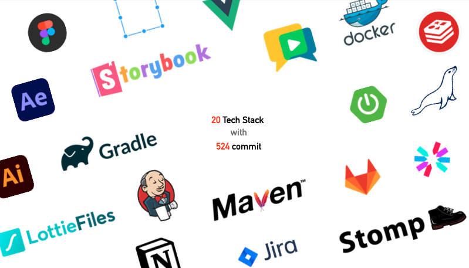

- **Common** : OpenVidu, Sock.js, WebStomp
- **BackEnd** : Spring, JPA ,Redis, Docker, MariaDB, JWT, Jenkins
- **FrontEnd** : Vue.js, Storybook, Lottie, Figma, Adobe Tools(after effects, illustrator)

<!-- 발표 ppt가 완성되면 이곳에 기술스택 이미지를 삽입한다 -->

<br>

### 📚 ERD

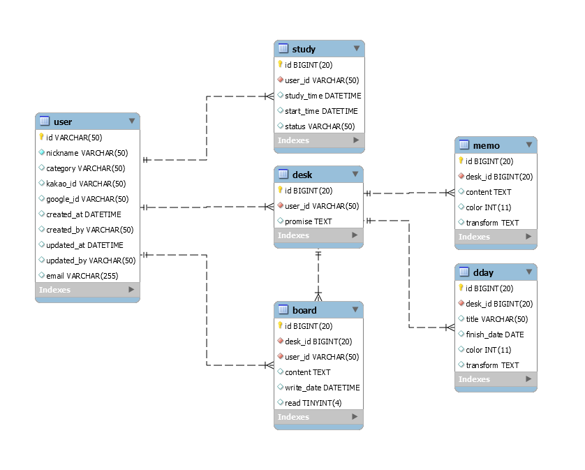

<br>

### 🔧시스템 구조도

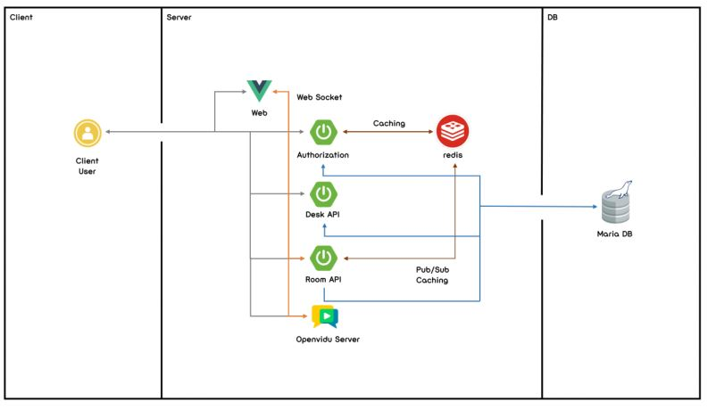

<br>

### :mag: ​Pages in Detail

> 각 페이지별 소개

🔸 **로그인(Login)**


🔸 **회원가입(Signup)**

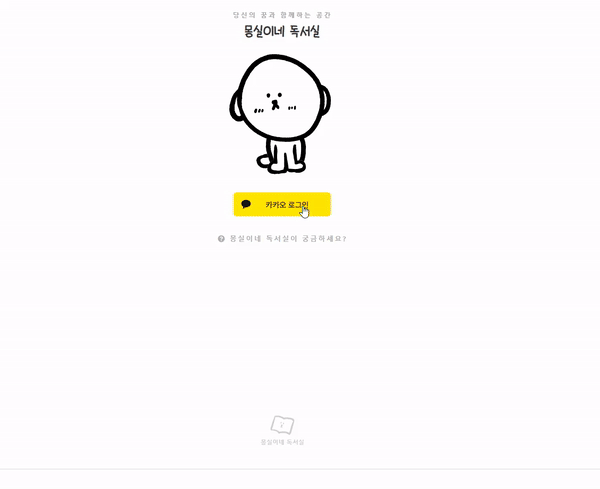

🔸 **열람실 선택 페이지(Select Room)**

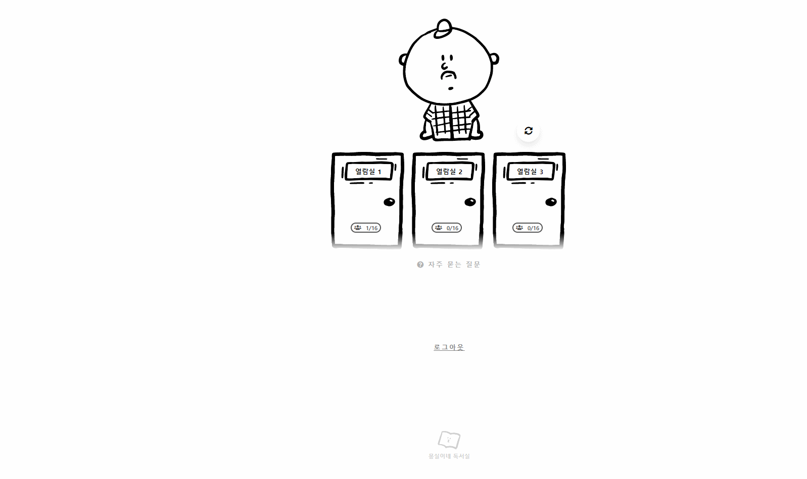

🔸 **열람실(Room)**

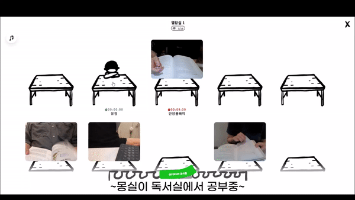

🔸 **프로필(Profile)**

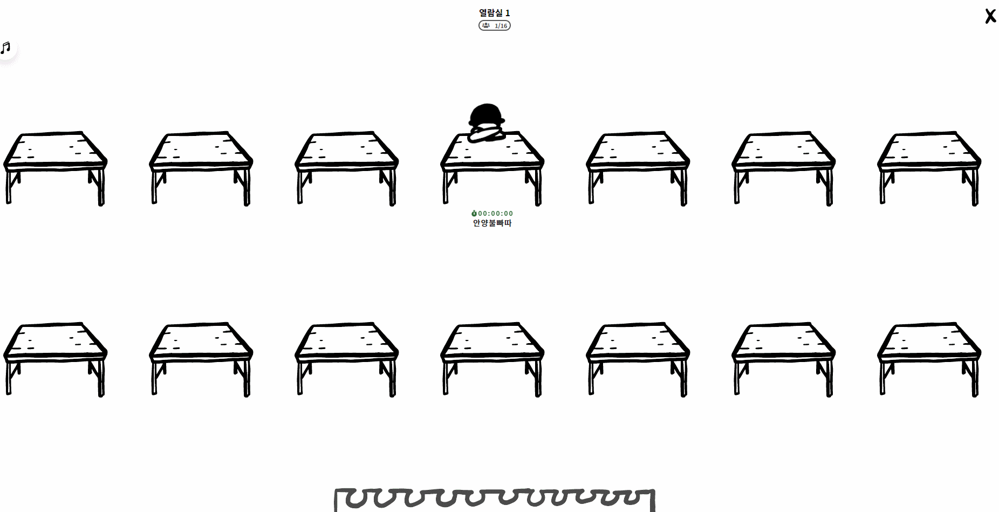

🔸 **책상(Desk) - 메모**

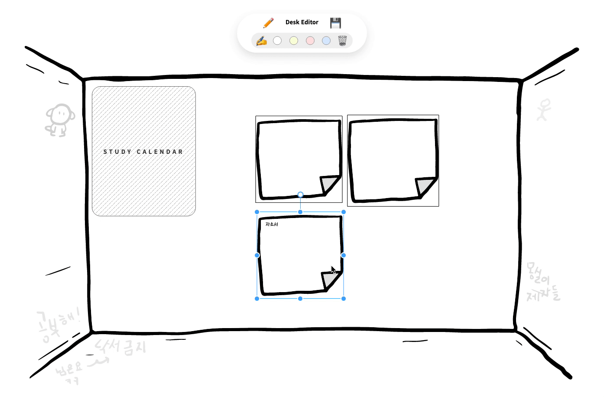

🔸 **책상(Desk) - 스터디 캘린더**

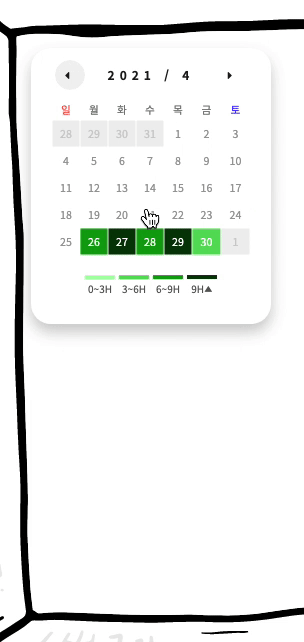

<br>

## 📄 문서 바로가기(Results)

📌 [기획](./docs/1_planning) - 아이디어 구체화, 요구사항 정의

📌 [설계](./docs/2_design) - 시퀀스 다이어그램, 아키텍처 설계, 와이어 프레임, 사용자 상태 정리, 프로토타입

📌 [개발](./docs/3_develop) - 개발 컨벤션, 깃 컨벤션, 개발 관련 자료 정리 

📌 [로그](./docs/4_log) - 개발 로그 

<br>


