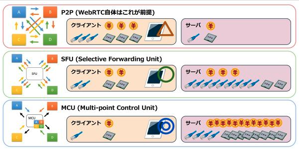

# WebRTC란?

### WebRTC

- P2P 프로토콜
- 1:1 통신의 경우 중간 서버를 경유할 필요가 없이 직접 Peer간 연결됨
- N:N 통신의 경우 Peer들 간에 Mesh 형태로 트래픽이 발생되고 Peer에서 들어오는 Traffic 을 Mixing 해야 한다 (우리 서비스)

미디어 서버는 WebRTC를 다자간 연결로 확장하기 위해 필요한 서버입니다. P2P 연결의 경우 송신자와 수신자가 서버 없이 각자의 비디오 및 오디오 등 미디어 스트림을 상대방과 직접 주고 받는 단순한 구조를 가지고 있습니다. 하지만 3명 이상의 참여자들이 실시간으로 데이터를 주고받고자 한다면 다음과 같은 2가지 방법을 사용해볼 수 있습니다.

Mesh Networking

P2P 연결과 마찬가지로 각 피어(Peer)가 모두 자신의 미디어 스트림을 나머지 피어들에게 직접 전달

- 장점
    - 비교적 비용이 적게 들고 그 구현이 간단
- 단점
    - 참여자가 많을수록 스트림의 수가 급격히 늘어나기 때문에 참여자 개인의 하드웨어 및 네트워크 환경에 큰 부담을 주는 구조

1대1 혹은 소규모 미디어 교환에 적합

SFU(Selective Forwarding Unit)

SFU 방식은 중앙 서버를 통해 종단간 미디어 트래픽을 중계하는 중앙 서버 방식입니다. SFU 방식은 사용자들로부터 각각의 미디어 스트림을 받아 매 순간마다 선택적으로 전달하는 라우팅 머신 역할의 중간 서버를 둡니다

- 장점
    - 중간 서버에서는 별도의 미디어 가공 과정을 거치지 않고 그대로 각 사용자들에게 전달
    - 비교적 서버에 부하가 적게 걸리고 지연시간 역시 낮음

1:N 스트리밍 서비스, 혹은 조금 더 확장하여 N:N 소통에 폭넓게 사용

MCU(Multi-point Control Unit)

MCU 방식은 각 참여자의 미디어 스트림을 중앙 서버에 한꺼번에 모아 믹싱한 후, 그 결과물을 다시 각각의 참여자들에게 전달

- 장점
    - 가공하여 수신단으로 전달하는 방식
    - 클라이언트와 네트워크의 부담이 현저히 줄어듦
- 단점
    - 중앙 서버의 CPU 사용량이 매우 커져 높은 컴퓨팅 파워가 요구

⇒ SFU 방식을 사용해야 할 듯!

janus - SFU 미디어 서버 기능 제공

### openvidu

- 웹 또는 모바일 애플리케이션에서 화상 통화 추가를 용이하게하는 플랫폼
- 개발자가 코드에 미치는 영향을 최소화하면서 앱에 실시간 통신을 매우 빠르게 추가 할 수 있도록 도와줌!